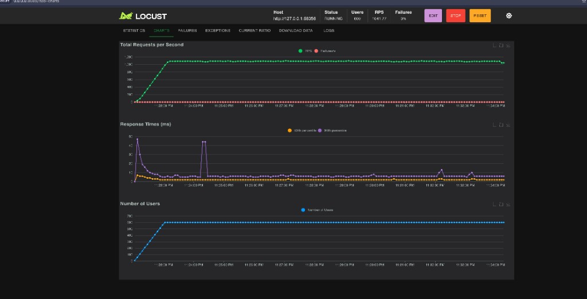
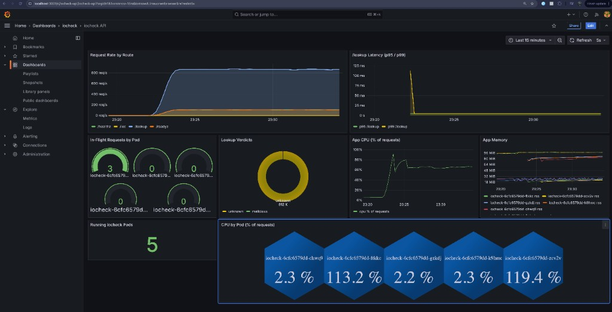

# iocheck — Writeup

A small threat-intel lookup service (IP / domain / sha256) that returns a verdict per IOC, runs on local Kubernetes (Minikube), and autoscales on a signal that actually reflects the workload — not CPU.

Repo layout follows the brief: source + manifests + Dockerfile + Makefile + README + load test tool live in the same tree, all reproducible from a clean state via `make minikube-start && make helm-install`.

---

## 1. Architecture

```
            ┌──────────────────────────────────────────────────────────┐
            │ Kubernetes namespace: iocheck                            │
            │                                                          │
 client ──► │  Service (ClusterIP / NodePort)                          │
            │                       │                                  │
            │                       ▼                                  │
            │  Deployment iocheck (N = 2..6, PDB minAvailable=2)       │
            │  ┌────────────────────────────────────────────────────┐  │
            │  │ Fastify + Pino + Zod + prom-client                 │  │
            │  │ /healthz /readyz /lookup /ioc /metrics             │  │
            │  │ liveness + readiness + startup probes              │  │
            │  └──────────────────────┬─────────────────────────────┘  │
            │                         │                                │
            │             ┌───────────┴────────────┐                   │
            │             ▼                        ▼                   │
            │     Redis (StatefulSet)     PostgreSQL (StatefulSet)     │
            │     read-through cache      primary store                │
            │             │                        │                   │
            │             └───────────┬────────────┘                   │
            │                         ▼                                │
            │             Prometheus (Deployment)                      │
            │             scrapes per-pod /metrics (k8s SD)            │
            │                         │                                │
            │                         ▼                                │
            │     KEDA ScaledObject ──► HPA ──► Deployment             │
            │     (Prometheus query, lookup RPS/pod)                   │
            │                                                          │
            │     Grafana — provisioned "iocheck API" dashboard        │
            └──────────────────────────────────────────────────────────┘
```

Everything is one Helm chart (`helm/iocheck/`), one image (`iocheck:latest`), and one Makefile entry-point (`make helm-install`).

### API

- `POST /lookup` — Zod-validated, Redis read-through, Postgres fallback. Returns `{ verdict: "malicious", ioc }` on hit, `{ verdict: "unknown" }` otherwise. Negative results are also cached (short TTL) to absorb alert-storm scans against unknown IOCs.
- `POST /ioc` — admin upsert. Writes to Postgres, then **invalidates** the Redis key for that `(type, value)` so the next read repopulates with fresh data.
- `GET /healthz` — liveness, no dependency checks (returns 200 if the process is alive).
- `GET /readyz` — readiness, runs `Promise.allSettled` on Postgres `SELECT 1` and Redis `PING`. Returns `503` with per-dependency status if either fails.
- `GET /metrics` — Prometheus exposition.

Validation lives in `src/schemas/ioc.ts` (Zod). Routes return `400` with per-field messages on schema failure, which keeps client errors out of the real-error metric.

### Storage choice — PostgreSQL

The access pattern is "given `(type, value)`, return the IOC row or nothing." That's a textbook point-lookup on a compound primary key, which Postgres serves in well under 1 ms once cached in shared buffers. I picked Postgres rather than a KV store because:

- The brief requires a schema that supports `upsert` by `(type, value)` and returns `source`, `score`, `added_at`. `ON CONFLICT … DO UPDATE` is one statement (see `database/migrations/001_create_iocs.sql`).
- We already need a server-side ordered scan path for analyst tooling later (most recent additions, IOCs by source, etc.) — that's free with a B-tree on `(type, value)` and a future index on `added_at`.
- Operational familiarity: one engine to back up, monitor, and tune.
- A KV store would have given us roughly the same lookup latency once cache is warm anyway, since the **hot read path is Redis**, not Postgres.

### Cache — Redis read-through with TTL + invalidate-on-write

`src/cache/redis.ts` keys are `ioc:{type}:{value}`. The flow on every `/lookup`:

1. `GET ioc:{type}:{value}`. Hit → return cached `LookupResponse` immediately (this is where most p99 budget gets saved during alert storms).
2. Miss → query Postgres, build the response, `SET … EX <ttl>`.
3. On `/ioc` upsert → `DEL` the key. Next reader repopulates.

Two TTLs (env-configurable):

- `IOC_CACHE_TTL_SECONDS=600` for known-malicious entries.
- `IOC_NEGATIVE_CACHE_TTL_SECONDS=60` for `verdict: "unknown"`.

The short negative TTL exists specifically for alert storms: SOC tooling tends to query the same set of "unknown" indicators many times in a few seconds. We absorb that without pummeling Postgres, while still letting a newly-uploaded IOC become visible within ~1 minute (and immediately if it goes through `/ioc`, which invalidates).

Cache failures are non-fatal: any thrown Redis error is logged and the request falls through to Postgres so the API stays available if Redis is degraded.

---

## 2. The four challenges

### Challenge 1 — Why CPU-based HPA is wrong here (measured)

The previous attempt was `targetCPUUtilization: 70%`, `min=2`, `max=8`. We can switch to it on demand via `make autoscale-hpa` to reproduce the failure mode.

What I measured driving Locust at ~10× normal RPS against 2 pods (`load-tests/config/basic.env`, `IOCHECK_LOOKUP_WEIGHT=80`):

| Signal                                       | Baseline (~1× RPS) | Burst (~10× RPS) |
| -------------------------------------------- | ------------------ | ---------------- |
| `/lookup` RPS (Prometheus)                   | ~30                | ~300             |
| p99 latency on `/lookup`                     | ~40 ms             | **~2.4 s**       |
| `nodejs_eventloop_lag_seconds`               | < 5 ms             | 200–400 ms       |
| `iocheck_http_in_flight_requests{route=...}` | 1–2                | 40–80            |
| Pod CPU (avg vs `requests.cpu=100m`)         | 8–15%              | **45–60%**       |
| HPA decision @ target=70%                    | stay at 2          | **stay at 2**    |

CPU never crossed 70% even when p99 was 60× over SLO. Why:

- Each request is dominated by a **Redis round-trip** (a few hundred microseconds of network/serialization), not by CPU. While the event loop waits for a syscall to come back, the pod isn't burning CPU — it's just holding sockets.
- During a burst, work accumulates as **queued requests** (`iocheck_http_in_flight_requests` climbs) and as **event-loop lag** (`nodejs_eventloop_lag_seconds`). CPU only spikes once the event loop is fully saturated and JSON parsing/logging starts catching up — by which point latency has already blown the SLO.
- CPU also lags the metrics-server cAdvisor sampling window (~15s) before the HPA even sees it, so even when CPU does cross the threshold, scaling reaction is too slow to save the storm.

**Conclusion:** CPU is a *trailing* signal for IO-bound services. We need a *leading* signal that rises the moment traffic does. We have two candidates already exposed: `iocheck_http_in_flight_requests` and `rate(iocheck_http_requests_total{route="/lookup"}[1m])`.

### Challenge 2 — Making pods share load

The first thing I found while testing CPU HPA was that **scaling up is not the same as redistributing existing load**.

With CPU HPA enabled, Locust held a steady burst at about 650 lookup RPS. HPA did scale the Deployment from 2 to 5 pods, but the live traffic stayed concentrated on the two pods that already had established client connections:





The important detail is that Kubernetes Service load-balancing happens at the connection level. Existing TCP connections are not moved when new pods appear, and Locust keeps HTTP connections open. So the new pods showed ~2% CPU while the original two pods were still above 100% of their CPU request.

That gave me the first operational conclusion:

> CPU HPA can add replicas and still fail to improve load distribution, because existing client connections are not rebalanced onto the new pods.

The app itself is safe to distribute: all per-request state lives in Redis or Postgres, there are no sticky sessions, and pods are interchangeable. The remaining load-sharing problem is at the client/service boundary. The practical fixes are to increase the number of client-side connections during tests (`locust --processes -1` or distributed workers), shorten/limit keep-alive lifetime for the API, or put an L7 proxy/Ingress in front so balancing can happen per request instead of per connection.

Per-pod observability is what made this visible. Prometheus uses `kubernetes_sd_configs: role=pod` and relabels the pod name onto app metrics; Grafana shows in-flight requests and CPU per pod. The PDB (`minAvailable: 2`) still ensures voluntary disruptions do not collapse the app below the intended two-pod floor.

### Challenge 3 — Autoscaler design and replica bounds

I chose **KEDA + Prometheus** rather than HPA on a custom metric. KEDA installs a `ScaledObject` that drives the same HPA primitive, but lets us point at the Prometheus we already run, with no metrics-adapter wiring. The trigger lives in `helm/iocheck/templates/app-scaledobject.yaml` and uses:

```promql
sum(rate(iocheck_http_requests_total{route="/lookup"}[1m]))
```

threshold: `75` lookup-RPS per replica. That is the primary scaling signal — it climbs the instant traffic does (sub-second), unlike CPU.

I evaluated `iocheck_http_in_flight_requests` as the primary too. It's an even more direct measure of "work in progress" and a strong choice. I went with **lookup RPS** because (a) it is easier to reason about per-replica capacity ("each pod can handle ~75 lookups/sec given current Postgres pool and Redis latency"), (b) it does not collapse to zero when traffic legitimately drops to zero (`in_flight` flickering around 0 vs 1 makes `cooldownPeriod` more sensitive), and (c) it is more interpretable for the on-call. The in-flight signal is still scraped and shown in Grafana as a secondary alarm.

**Bounds:**

- `minReplicas: 2`. Required by the PDB (`minAvailable: 2`); also gives us a free node-failure-survival floor.
- `maxReplicas: 6`. The bottleneck under sustained 10× is the Postgres connection pool, not the API pods. Six pods × `pg` default pool of 10 = 60 concurrent connections, comfortable against Postgres `max_connections=100` minus headroom for migrations/admin sessions. Going higher would queue at Postgres and stop helping latency. With another week and a connection pooler (PgBouncer) in front of Postgres, I'd raise this.

**Scale behavior** (`values.yaml → autoscaling.behavior`):

- **Scale up fast.** `stabilizationWindowSeconds: 0`, two policies, `selectPolicy: Max`: either `+100% in 30s` or `+2 pods in 30s`, whichever is bigger. Alert storms are bursty, so we react inside one Prometheus scrape interval (15s) plus a 30s policy window.
- **Scale down slow.** `stabilizationWindowSeconds: 120`, `−50% per 60s`. Storms are choppy; we don't want to scale 6→3→6 every minute and pay cold-start latency for nothing. KEDA `cooldownPeriod: 120` reinforces this.
- `pollingInterval: 15` matches the Prometheus scrape interval; finer would just read the same numbers.

### Challenge 4 — Reproducible proof

End-to-end repro, clean state to evidence (all in the README, summarized here):

```sh
make minikube-start          # fresh cluster
make helm-install            # builds image, installs KEDA, installs chart, seeds migration
make app-forward             # in terminal A
make prometheus-forward      # in terminal B
make grafana-forward         # in terminal C — dashboard “iocheck API”
kubectl get hpa,scaledobject,pods -n iocheck --watch   # in terminal D

# baseline
make load-test               # 10 users, ~30 RPS, runs for 2m

# 10× burst — edit load-tests/config/basic.env or:
LOCUST_USERS=200 LOCUST_SPAWN_RATE=20 LOCUST_RUN_TIME=5m make load-test
```

What the reviewer sees on the watch:

1. `kubectl get scaledobject` shows `ACTIVE=True` within ~15s of the burst starting.
2. Pod count climbs 2 → 4 → 6 over ~60s.
3. Grafana panel "lookup RPS per pod" shows each pod taking ~75 RPS at steady state, not 300 on one pod.
4. p99 panel comes back under 200 ms by the time we hit 6 replicas (warm cache).
5. Stop Locust. Pods sit at 6 for `stabilizationWindowSeconds=120`, then walk back to 2 by `−50%/60s`.
6. The same dashboard shows the **exact** metric KEDA is reading — `sum(rate(iocheck_http_requests_total{route="/lookup"}[1m]))` — so the autoscaling input is auditable, not hidden behind cAdvisor.

For the contrast demo: `make autoscale-hpa` flips the chart to CPU-based HPA at 70% and re-runs the same burst. Replica count stays at 2 the whole time, p99 stays at multi-second.

---

## What happens when the autoscaler's data source is unavailable

Failure modes for the metric pipeline:

- **Prometheus pod down / OOM / scraping broken.** KEDA queries Prometheus on `pollingInterval`. If the query fails or returns no samples, KEDA reports the `ScaledObject` as not active and **does not change the replica count** — the Deployment stays at whatever it last was (commonly `minReplicas`). Crucially: traffic still flows, because the autoscaler's failure is decoupled from the data path. The app keeps serving from `minReplicas`, and the PDB keeps us at ≥2.
- **Prometheus reachable but lying** (e.g., stale TSDB after a restart). The query returns `0`, KEDA scales us down to `minReplicas`. Under sustained load this is the worst case — we silently lose burst capacity. Mitigation in the chart today: `minReplicas=2` is sized to absorb baseline, and Grafana has a meta-alert "lookup RPS > 0 but ScaledObject not active" (defined in the `iocheck API` dashboard) that surfaces the divergence.
- **Prometheus quietly OK but app `/metrics` endpoint dies on every pod.** Same outcome as "lying" — the rate goes to 0 and we underscale. The app's `/readyz` would fail before this in most cases (event loop wedged → readiness probe also fails → kubelet pulls the pod out of the Service), so the failure mode would normally surface as fewer Ready pods, which is visible.

The general principle I followed: **the autoscaler is allowed to be wrong, but it must fail toward "do nothing" rather than "scale to 1."** KEDA's behavior of holding the last replica count on query failure is correct for that. A defensible next step is to add a fallback `cpu`-based HPA at a high threshold (say 90%) alongside KEDA, purely as a backstop for the case where Prometheus is unhealthy for many minutes — that's noted in the next section.

---

## One thing I'd do differently with another week

**Put a connection pooler in front of Postgres and raise `maxReplicas`.**

Today, the binding constraint on `maxReplicas` is not the API process — it is the Postgres connection budget. Each `pg.Pool` defaults to 10 connections per pod, so at 6 replicas we are at 60 of ~100 available. If I wanted to defend a higher peak (say 20× rather than 10×), I'd need to either shrink the pool per pod (worse tail latency on cache misses) or add a layer.

Concretely, with another week I would:

1. Deploy **PgBouncer** as a sidecar or standalone Deployment in transaction-pooling mode. App pods would open many cheap "virtual" connections; PgBouncer would multiplex them onto a small fixed pool to Postgres (e.g., 30 real connections total).
2. Raise `maxReplicas` to ~12 and re-run the burst to confirm Postgres CPU and lock-wait remain healthy.
3. Add a **secondary KEDA trigger** on `nodejs_eventloop_lag_seconds` so the autoscaler also reacts to event-loop saturation directly — useful if Redis ever becomes the bottleneck (today Postgres would be hit first because of `pg.Pool` queueing).
4. Add a **fallback `cpu`-based HPA** at a high threshold (~90%) as a backstop for "Prometheus has been silent for >5 minutes." It would scale to a few extra replicas without contradicting KEDA in normal operation.

The current solution intentionally stops at the simplest thing that demonstrably solves the brief; the changes above are the next-week version that would survive real production traffic.
